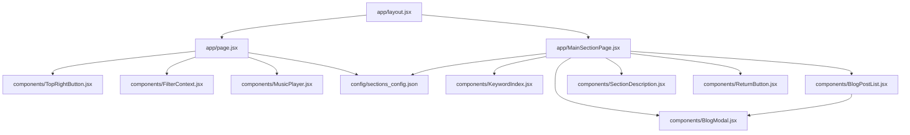

```bash
[ebit@Nicolette86132 app]$ tree
.
├── MainSectionPage.jsx
├── api
│   ├── music-list
│   │   └── route.jsx
│   ├── read-post-detail
│   │   └── route.jsx
│   └── read-posts
│       └── route.jsx
├── blog
│   └── [section]
│       └── page.jsx
├── components
│   ├── BlogModal.jsx
│   ├── BlogPostList.jsx
│   ├── FilterContext.jsx
│   ├── KeywordIndex.jsx
│   ├── MusicPlayer.jsx
│   ├── ReturnButton.jsx
│   ├── SectionDescription.jsx
│   └── TopRightButton.jsx
├── favicon.ico
├── globals.css
├── layout.jsx
└── page.jsx

8 directories, 17 files
[ebit@Nicolette86132 app]$ pwd
/home/ebit/void-island-site/app
[ebit@Nicolette86132 app]$
```